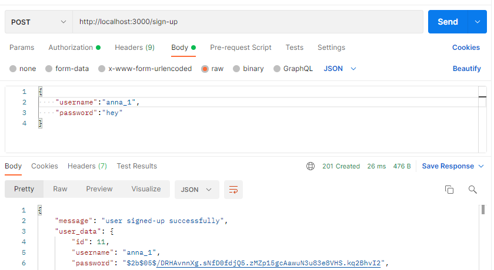
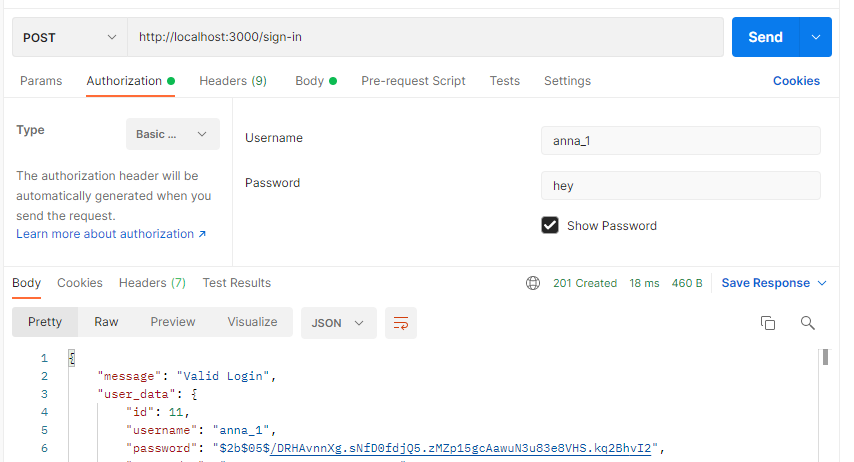
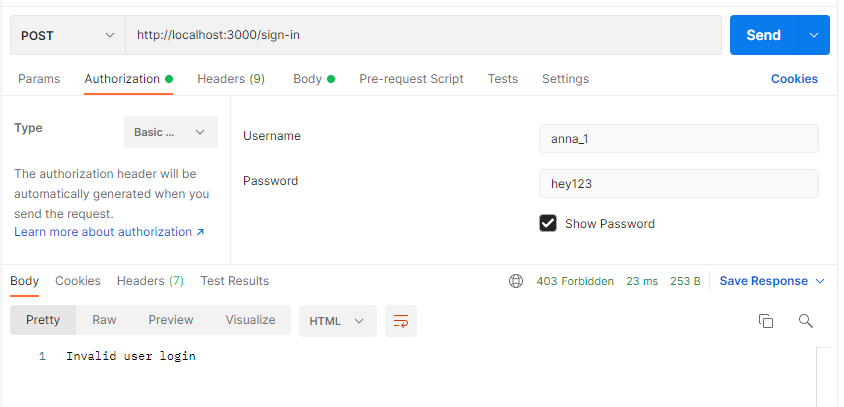
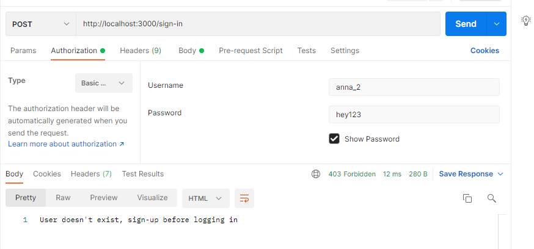

# basic-auth

## Description

An Express server that implements Basic Authentication, with sign-up (`/sign-up` endpoint) and sign-in (`/sign-in` endpoint) capabilities, using a Postgres database for storage.

## Links

* Heroku:
* Pull Request:

## Endpoint Results

* using the `/sign-up` endpoint:

* using the `/sing-in` endpoint:

* using the `/sing-in` endpoint with incorrect password:

* signing-in for unexcited account:

## UML

